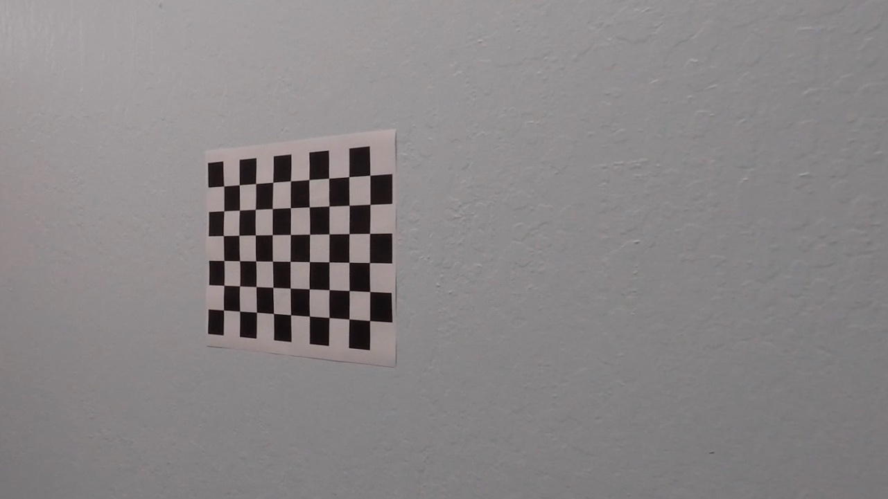
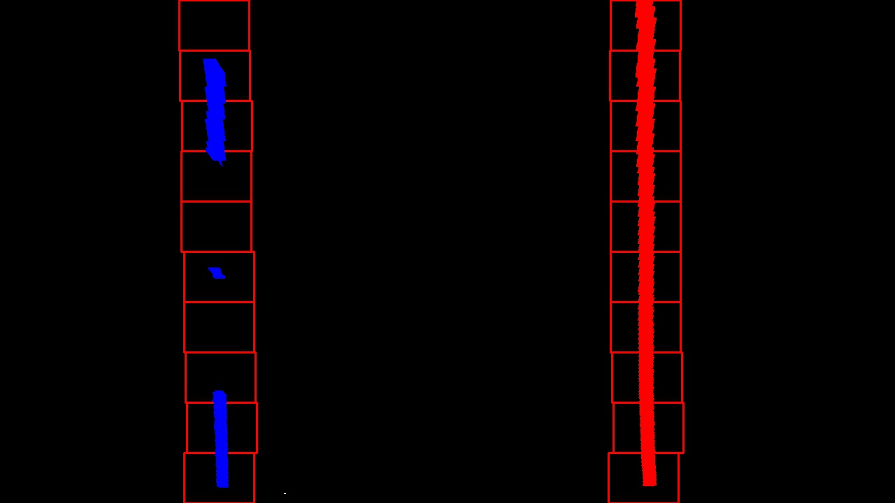
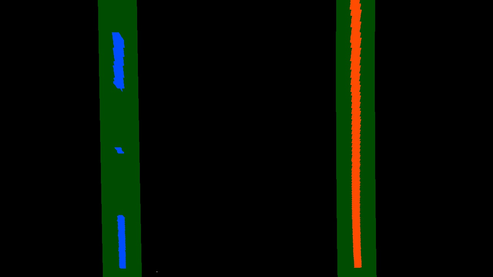
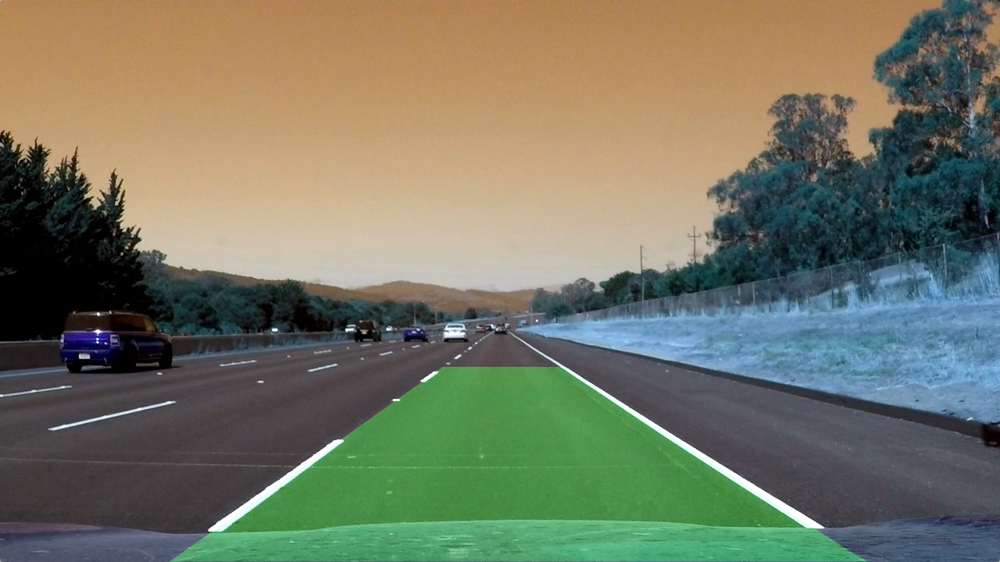

########################################### ADVANCED LANE FINDING ####################################################

GOAL
The goal is to write a software pipeline to identify the lane boundaries in the video

Steps :

step1 : CAMERA CALIBRATION and DISTORTION CORRECTION
* Light rays often bend at the edges of curved lens of a camera and creates the effect of distortion of images.
* Camera has to be calibrated initially to get the camera matrix and distortion coefficients through calibrate_camera function.
    input : objpoints, imgpoints, size of image
    output : camera matrix, distortion coefficients, rvecs, tvecs
* undistortion
    input : camera matrix, distortion coefficients
    output : undistorted image

step2 : COLOR TRANSFORMS AND GRADIENT THRESHOLD 
* Gradient threshold
    As the lane lines are almost vertical, we use gradient threshold
    * Along X axis using sobel operator
    * Directional threshold
  Combine the sobel_x and directional thresholds
  
* Color threshold
    * R and G threshold for detecting yellow color
    * L channel threshold for different lighting conditions and shadows
    * S channel threshold for distinguishing differrent colors like white and yellow.
    
input : Cobination of Gradient and color thresholds
output : Binary thresholded image

step3: PERSPECTIVE TRANSFORM (BIRD'S EYE VIEW)
* Apply a perspective transform to rectify the binary thresholded image
* Destination points are chosen such that lines are almost parallel in the transformed immage.
* Compute the perspective transform.
    input : source points, destination points
    output : transformation matrix(M)
* Compute the warped perspective image.
    input : binary thresholded image, M
    output : Thresholded warped image
    

    
step4: DETECTING LANE PIXELS
* Histogram
    The two highest peaks from histogram as a starting point for determining where the lane lines are.
    
* Sliding windows search
    After determining where the lane lines are, we use sliding windows moving upward further along the road to determine where the lane lines go. Find all the x and y coordinates for all the nonzero pixels found using this method.
    
* Polynomial Fit
    Fit the polynomial to the line by using the x and y coordinates of the pixels found through Sliding windows method.
    
* Search around previously detected lane lines.
    Consecutive frames are likely to have lane lines in roughly similar positions. We search around a margin of 50 pixels through previously detected lane lines.
    

step5: DETERMINE RADIUS OF CURVATURE AND CENTER OFFSET
* Radius of curvature
    The radius of curvature is computed from the polynomial fit according to the formula.
    As the polynomial fit is in pixels and radius of curvature is in meters, apply the transformation.
* Center offset
    The mean of lane pixels gives the lane center and center of the image gives the car center.
    The difference between lane center and car center gives the lane offset.

step6: PAINTING LANE AREA AND OUTPUT IMAGE
* Paint the lane area and apply the inverse transformation(Minv).
* Combine this image with the original image.

step7: Apply the pipeline on the video.

Areas of improvement:
* In the harder challenge, there are sharper turns withiin less distance, to tackle that the smaller section of transform should be used.
* Color and gradient thresholds can be improved more to tackle harder challenge.

