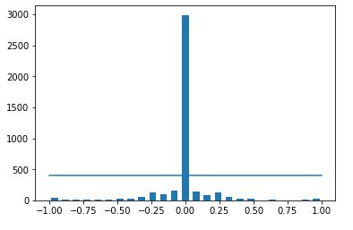
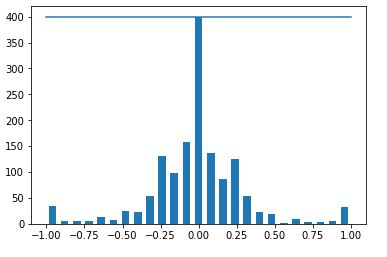
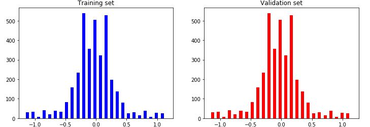
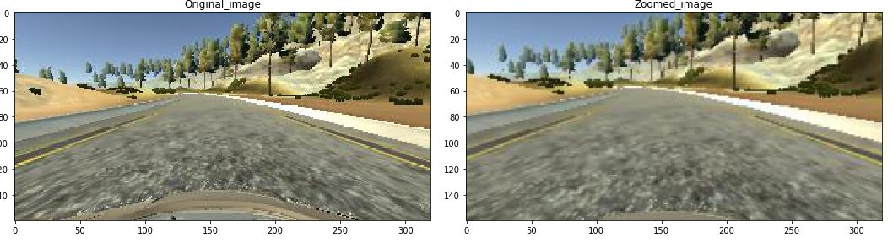
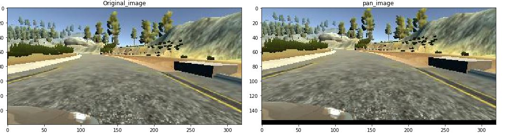
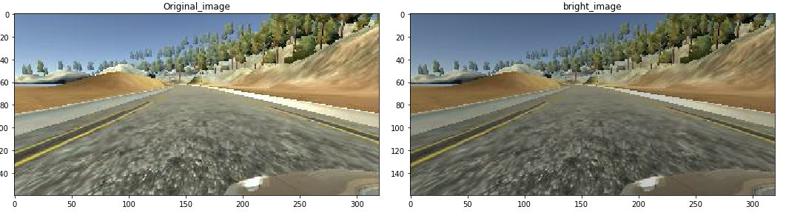
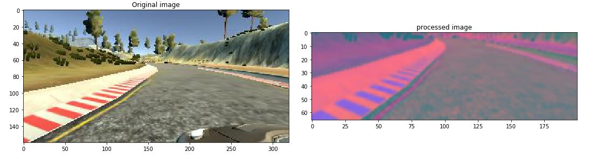
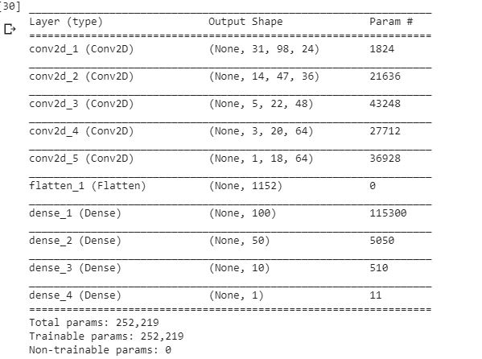
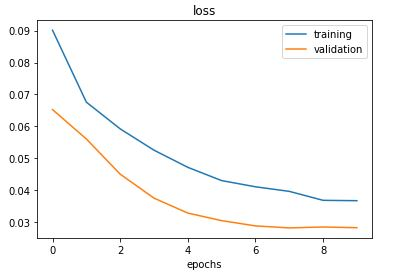

############################################# BEHAVIORAL CLONING #####################################################################
Goal: 
The objective of this project is to train a car using Neural Networks to drive itself in the simulator.

step1 :
Use the simulator to collect data of good driving behavior

step2 :
# As we are interested in center, left, right camera images and their corresponding steering angles, omit the other columns.
# Visualizing the distribution of collected data

# The above image shows the no. of samples for the corresponding steering angles.

step3:
# As most of the track is straight, it is more biased to zero steering angle and moving straight.
# Limit the samples per bin to 400.

step4:
Augmentation techiques:
# Using left and right cameras to simulate the effect of car wandering off to the side and recovering.
# Adding 0.15 angle to the left camera and subtracting 0.15 angle from the right camera allows left camera to move right to get to center and vice versa

# Do the train and validation split and visualize the distribution of steering angles to no. of samples

# Zoom the original image to generate more data.

# Pan the image

# image random brightness

# flipping the image

step5:
preprocessing the images:
# Crop the image so that unwanted things will be omitted
# Convert RGB to YUV and do smoothing
# Resize the image
# Normalize the image by dividing by 255

step6:
Training the NVIDIA model :
# Use the batch generator.
# Model taken from nvidia "end to end learning for self driving cars" paper which contains
layer1 - convolutional layer with 24 5x5 filters followed by elu activation function
layer2 - convolutional layer with 36 5x5 filters followed by elu activation function
layer3 - convolutional layer with 48 5x5 filters followed by elu activation function
layer4 - convolutional layer with 64 3x3 filters followed by elu activation function
layer5 - convolutional layer with 64 3x3 filters followed by elu activation function
Fully connected layer with 100 neurons followed by elu activation function
Fully connected layer with 50 neurons followed by elu activation function
Fully connected layer with 10 neurons followed by elu activation function

Training method:
optimizer : Adam
No. of epochs = 10
shuffle = True

# No test set used, since the success of the model is evaluated by how well it drives on the road and not by test set loss
# Keras' fit_generator method is used to train images generated by the generator

step7 :
run1.mp4 ---- shows the car driving autonomously on first track
run2.mp4 ---- shows the car driving autonomously on second track

# Initially, no. of epochs were 15, model started to overfit and going out in second track. So, reduced no. of epochs to 10.

Future work: Should be able to control the throttle and brake along with steering angle.