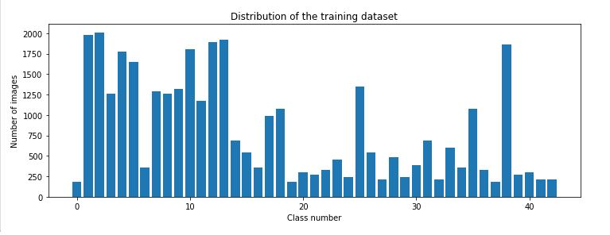
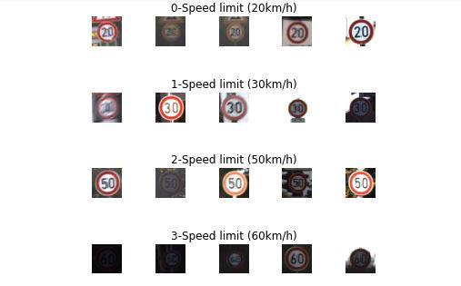
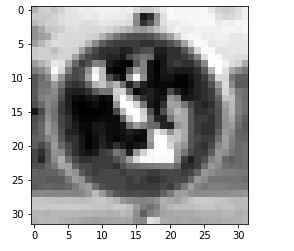
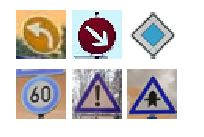

################################### TRAFFIC SIGN RECOGNITION ###################################################################

STEPS :

step1 : 
- Load the data
- The data is a dictionary with 4 key-value pairs
    * features: 4D array consists of (n_of_examples, width, height, channels)
    * labels  : 1d array consists of label of the traffic sign
    * sizes   : is a list containing tuples, (width, height) representing the original width and height the image
    * coords  : is a list containing tuples, (x1, y1, x2, y2) representing coordinates of a bounding box around the sign in the image.

step2 :
- Explore, visualize the dataset.

step3 :
- Preprocessing the dataset:
    * Convert to gray scale : helps to reduce training time
    * Normalization : helps in mean zero and equal variance

step4 :
- Design, train and test a model architecture
    * 5x5 convolution
        input: 32x32x1
        output: 28x28x6
    * RELU
    * 2x2 max pool
        input: 28x28x6
        output: 14x14x6
    * 5x5 convolution
        input: 14x14x6
        output: 10x10x16
    * RELU
    * 2x2 max pool
        input: 10x10x16
        output: 5x5x16
    * 5x5 convolution
        input: 5x5x16
        output: 1x1x400
    * RELU
    
    * Flatten 
    * Fully connected layer1
    * Fully connected layer2
    * Dropout layer
    * Fully connected layer 
        output : 43
        
- batch size: 25
- epochs: 15
- learning rate: 0.001
- mu: 0
- sigma: 0.1
- dropout : 1

Validation_accuracy = 95.1
    
step5:
* Test the model on new images
    test_accuracy = 92.4
    
step6:
* Took 6 new images from web and test the model on them.

    test_accuracy = 100
    

step7:
* Print out the top five softmax probabilities for the predictions on the German traffic sign images found on the web.
* The model is 100 prcent certain of the images got from the web.

Field of Improvement : Data Augmentation(creating fake iamges) like random brightness, random scaling etc., should be done so that number of training images will be increased which results in better accuracy

